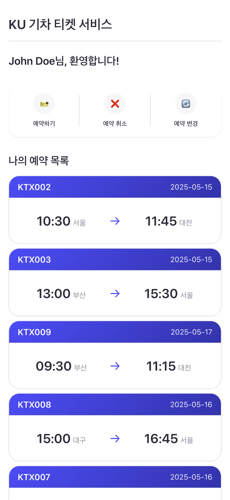
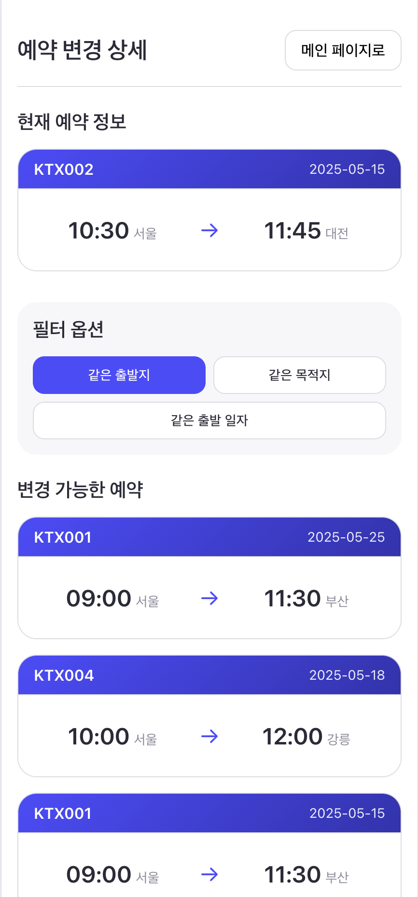

# HCI Assignment 3

2017320124 송동욱

### Screenshots

<div style="display: flex; gap: 10px;">
  
  
  
  
</div>

## Get Started

### Requirements

- Node.js (v18.17.0)
- npm (v9.6.7)

If you don't have Node.js, download it from [here](https://nodejs.org/), or use [nvm](https://github.com/nvm-sh/nvm)(node version manager) to install it.

### Install

Minimal packages have been installed to enable essential features like routing and CSV file operations.

```bash
npm install
```

### Run

This script will run the server and open the browser automatically.

```bash
npm run dev
```

If you want to run the server and client separately, run the following commands.

```bash
npm run dev:server
npm run dev:client
```

## Implementation

A mobile web version of train reservation service.
It includes

- reservation
- cancellation
- modification

Some additional requirements are satisfied as follows:

- Add Router to navigate between pages
  - Access via /foo instead of /foo.html
- csv file RU operations
  - Implemented server especially for update operations
- Add some style information
- Add mobile web version

Some additional comments

- Managing CSV files in server and including them in git version control is not a real-world practice, but for the purpose of this assignment, we did not ignore them and included them in version control.

## Architecture

```
📦 Root
├── 📂 public
│   └── 📂 pages (each route HTML files)
├── 📂 scripts
│   ├── 📂 components (reusable UI components)
│   ├── 📂 constants (constants)
│   ├── 📂 models (domain models)
│   └── 📂 services (services)
│       ├── 📂 common (common utilities)
│       └── 📂 reservation (reservation services)
└── 📂 server (Express server)
```

### Key Files

**1. Router Configuration (`scripts/router.js`)**

- Maps HTML files and JS files for each route
- Implements SPA routing
- Supports dynamic route parameters (e.g. `/detail/:number`)
- Handles page transitions and history management

**2. Domain Service (`scripts/services/reservation/ReservationService.js`)**

- Implements reservation service using Command and Strategy patterns
- Provides reservation confirmation, cancellation, and filtering features
- Manages instances through Factory pattern

**3. Repository Layer (`scripts/services/reservation/repository/CSVReservationRepository.js`)**

- Abstracts data access through Repository pattern
- Handles CRUD operations based on CSV files
- Processes domain model conversions
